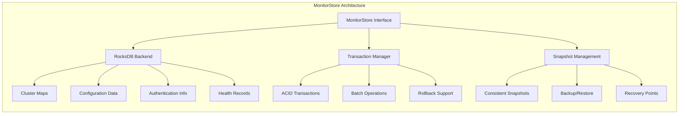
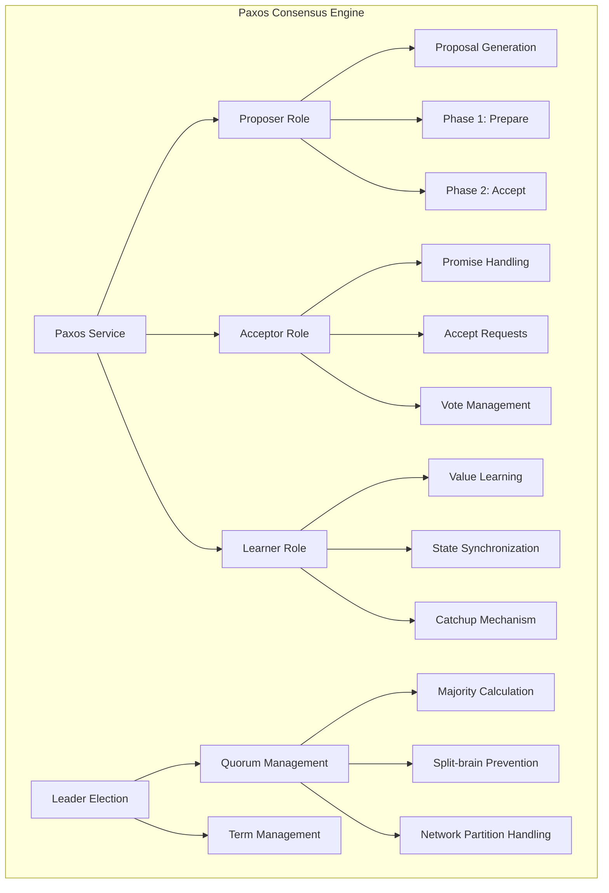
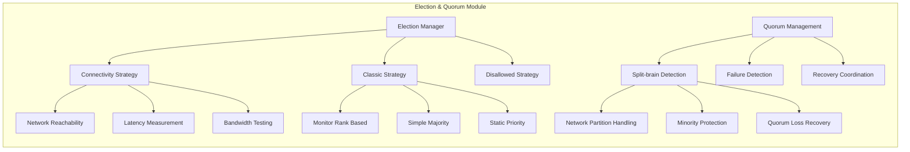
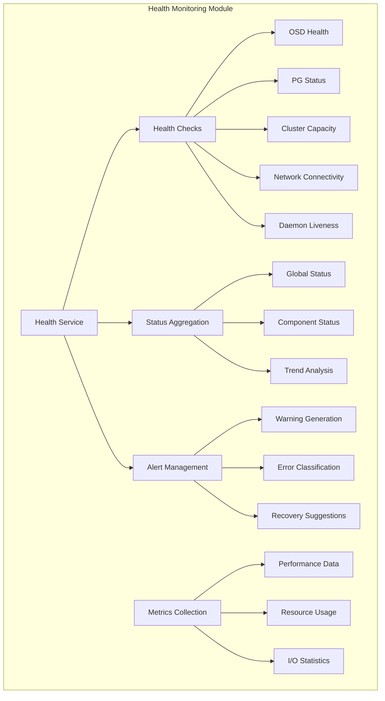
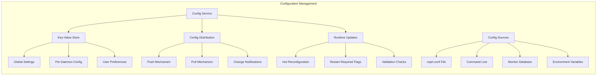
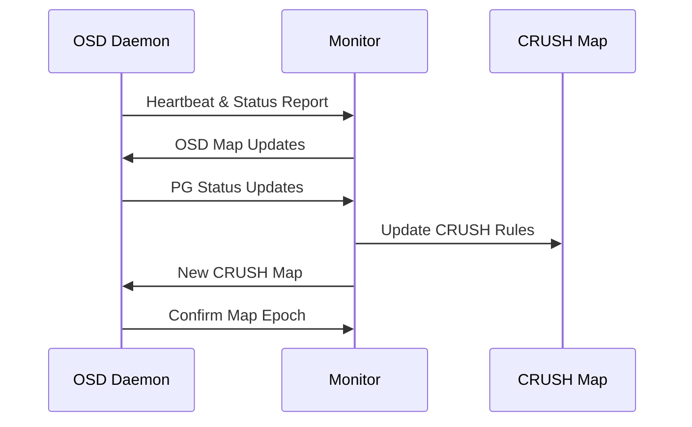
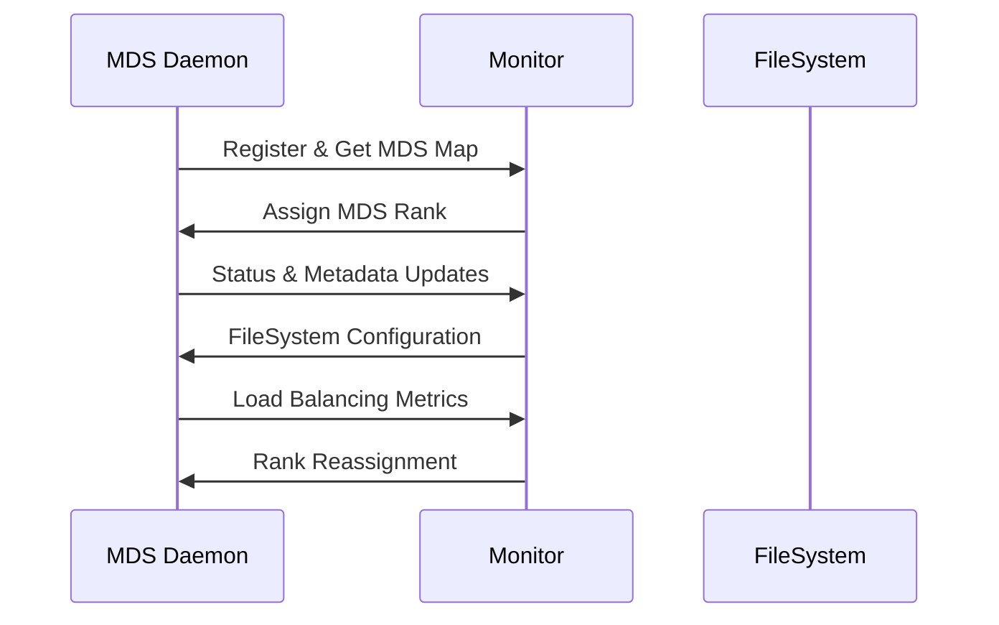

# Ceph Monitor Architecture Analysis
## Monitor Overall Architecture Overview
### Core Functional Positioning
Ceph Monitor serves as the control plane of the cluster, primarily responsible for the following core duties:
- **Cluster Map Maintenance**: Managing key mapping information including MonitorMap, OSDMap, CRUSHMap, MDSMap, PGMap, etc.
- **Status Monitoring & Health Checks**: Real-time monitoring of cluster status and generating health reports
- **Distributed Consistency Guarantee**: Ensuring cluster metadata consistency across all nodes based on Paxos algorithm
- **Authentication & Authorization**: Managing CephX authentication system and user permissions
- **Election & Arbitration**: Maintaining Monitor quorum and handling failure recovery
### Monitor Architecture Diagram

```mermaid
graph TB
    subgraph "Ceph Monitor Core Architecture"
        A[Monitor Daemon] --> B[MonitorStore]
        A --> C[Paxos Engine]
        A --> D[Election Module]
        A --> E[Health Module]
        A --> F[Config Module]
        A --> G[Auth Module]
        B --> B1[ClusterMap Storage]
        B --> B2[Configuration DB]
        B --> B3[Transaction Log]
        C --> C1[Proposal Processing]
        C --> C2[Leader Election]
        C --> C3[Consensus Coordination]
        D --> D1[Connectivity Strategy]
        D --> D2[Quorum Management]
        D --> D3[Split-brain Prevention]
        E --> E1[Health Checks]
        E --> E2[Status Reporting]
        E --> E3[Alert Generation]
        F --> F1[Config Key-Value Store]
        F --> F2[Runtime Configuration]
        F --> F3[Config Distribution]
        G --> G1[CephX Authentication]
        G --> G2[User Management]
        G --> G3[Capability Control]
    end
    subgraph "External Interactions"
        H[OSD Daemons] --> A
        I[MDS Daemons] --> A
        J[Client Applications] --> A
        K[Admin Tools] --> A
        L[Dashboard/Grafana] --> A
    end
```

---
## Monitor Core Submodule Analysis
### MonitorStore Storage Engine
**Functional Overview**:
MonitorStore is the persistent storage engine of Monitor, implemented based on RocksDB, responsible for storing all critical cluster metadata.
**Core Architecture**:

### Paxos Consensus Engine
**Functional Overview**:
The Paxos engine is the most core module of Monitor, implementing distributed consensus algorithms to ensure cluster metadata consistency across all Monitor nodes.
**Architecture Design**:

**Core Operating Mechanism**:
1. **Proposal Phase**:
```bash
# Check current quorum status
ceph quorum_status
```
1. **Consistency Guarantee Process**:
   - **Phase 1 (Prepare Phase)**: Leader sends Prepare requests to all Acceptors
   - **Phase 2 (Accept Phase)**: Collects majority responses and sends Accept requests
   - **Commit Phase**: After reaching consensus, broadcasts commit messages to all nodes
### Election & Arbitration Module
**Functional Overview**:
Responsible for Monitor cluster Leader election, quorum maintenance, and failure detection, ensuring cluster availability under various network conditions.
**Election Strategy Architecture**:

**Key Configuration Parameters**:
```ini
# Monitor election related configuration
[mon]
mon_election_timeout = 5
mon_lease = 5
mon_lease_renew_interval_factor = 0.6
mon_lease_ack_timeout_factor = 2.0
mon_accept_timeout_factor = 2.0
```
**Election Trigger Conditions**:
- Monitor node startup or restart
- Network partition or connection disconnection
- Leader node failure or unresponsiveness
- Manual election trigger (operational intervention)
### Health Monitoring Module
**Functional Overview**:
Real-time monitoring of cluster component health status, generating alert information, and providing detailed diagnostic data.
**Monitoring Architecture**:

**Health Check Command Examples**:
```bash
# Get overall cluster status
ceph status
ceph -s
# View detailed health information
ceph health detail
# Monitor cluster status changes
ceph -w
# View specific component status
ceph pg stat
ceph osd stat
ceph mon stat
```
**Health Status Classification**:
- **HEALTH_OK**: Cluster running normally
- **HEALTH_WARN**: Warnings exist but don't affect data safety
- **HEALTH_ERR**: Errors exist requiring immediate attention
### Configuration Management Module
**Functional Overview**:
Managing cluster and daemon configuration parameters, supporting runtime configuration updates and distribution.
**Configuration Management Architecture**:

**Configuration Operation Commands**:
```bash
# Set global configuration
ceph config set global public_network 192.168.160.0/24
# View specific daemon configuration
ceph config show osd.0
ceph config show-with-defaults osd.0
# Set configuration key-value
ceph config-key set <key> <value>
# Generate minimal configuration file
ceph config generate-minimal-conf > /etc/ceph/ceph.conf
```
## Monitor Interaction Relationships with Other Components
### Monitor-OSD Interaction
**Interaction Mode**:

**Key Interaction Content**:
- **Heartbeat Detection**: OSDs periodically report their alive status to Monitor
- **Status Updates**: PG status, capacity information, performance metrics
- **Map Distribution**: OSD Map, CRUSH Map update notifications
- **Failure Handling**: OSD failure detection and marking
### Monitor-MDS Interaction
**Interaction Architecture**:

---
