## MDS System Architecture Overview

Ceph MDS is the core component of CephFS (Ceph File System), responsible for handling all file system metadata operations. MDS adopts a distributed, scalable architecture that supports multi-active MDS and dynamic load balancing.

### MDS Position in Ceph Ecosystem

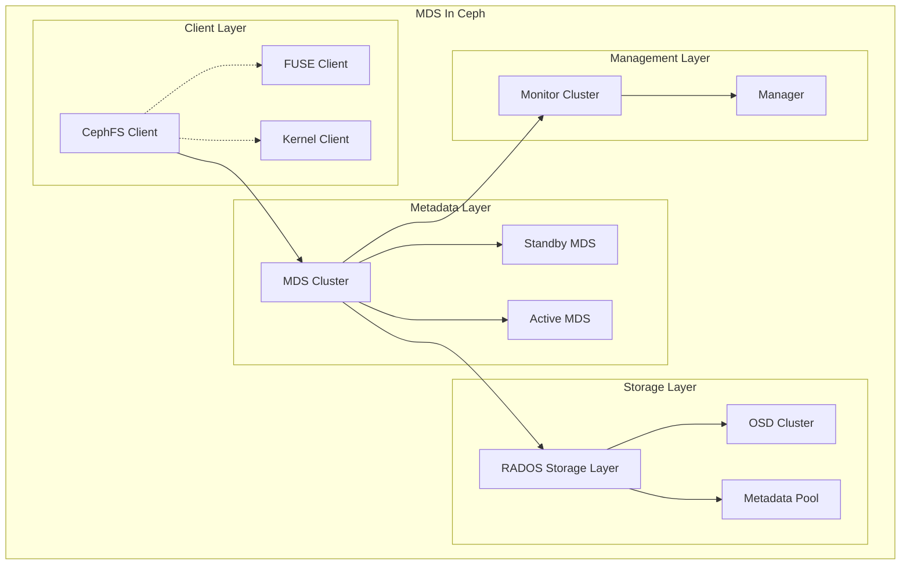
### MDS Module Architecture


## MDS Core Submodule Architecture Analysis

### MDSMap Management Module

MDSMap is the core module for MDS cluster state management, responsible for maintaining MDS cluster topology information and status.

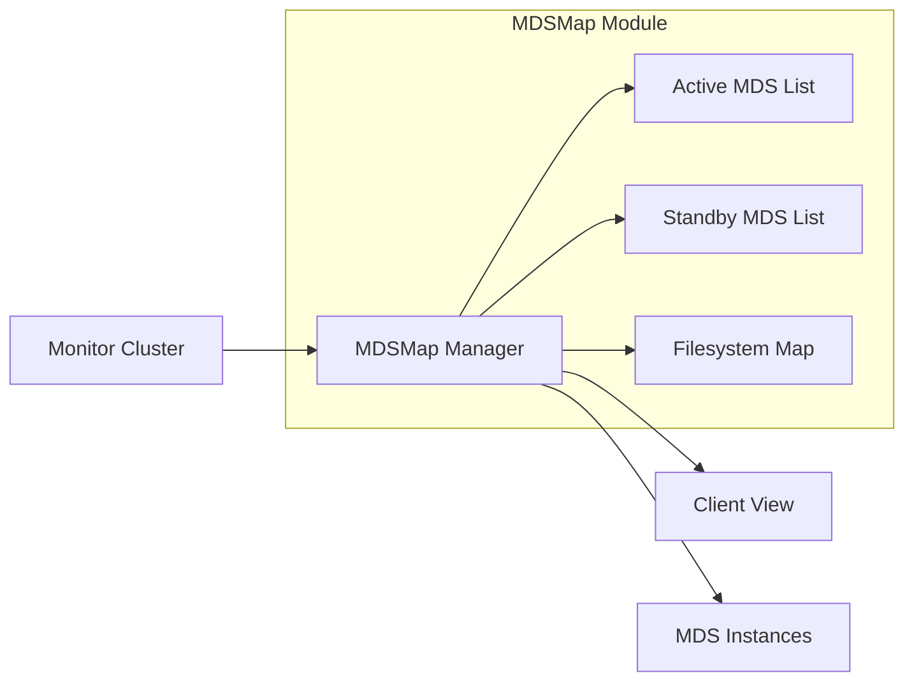

**Core Functions:**
- MDS cluster member management
- Rank allocation and failover
- Filesystem to MDS mapping
- State synchronization and version control

**Key Configuration Parameters:**
```bash
# Set maximum active MDS count
ceph fs set <fsname> max_mds <count>

# View MDS status
ceph mds stat
ceph fs status <fsname>
```

### Session Management Module

The Session management module handles client connections and session state maintenance.

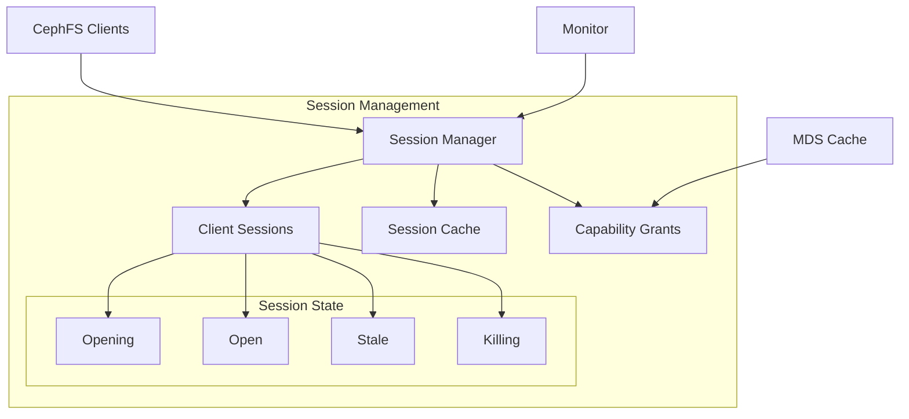

**Core Functions:**
- Client connection authentication
- Session lifecycle management
- Capability distribution and revocation
- Session timeout handling

### MDCache Module

MDCache is the core caching module of MDS, responsible for metadata caching, consistency maintenance, and distributed coordination.

```mermaid
graph TB
    subgraph "MDCache Architecture"
        MDCache[MD Cache Manager]
        
        subgraph "Cache Structures"
            Inodes[Inode Cache]
            Dentries[Dentry Cache]
            Dirfrags[Dirfrag Cache]
        end
        
        subgraph "Cache Operations"
            Fetch[Fetch Operations]
            Discover[Discovery]
            Migration[Cache Migration]
            Trim[Cache Trimming]
        end
        
        subgraph "Coherency"
            Locks[Distributed Locks]
            Caps[Capabilities]
            Leases[Client Leases]
        end
        
        MDCache --> Inodes
        MDCache --> Dentries
        MDCache --> Dirfrags
        
        MDCache --> Fetch
        MDCache --> Discover
        MDCache --> Migration
        MDCache --> Trim
        
        MDCache --> Locks
        MDCache --> Caps
        MDCache --> Leases
    end
    
    RADOS[RADOS Storage] --> Fetch
    Clients[CephFS Clients] --> Caps
    OtherMDS[Other MDS] --> Migration
```

**Core Functions:**
- Distributed metadata caching
- Cache consistency protocol
- Metadata prefetching and predictive caching
- Memory management and LRU eviction

### MDS Balancer Module

The load balancing module ensures metadata load is evenly distributed among multiple active MDS.

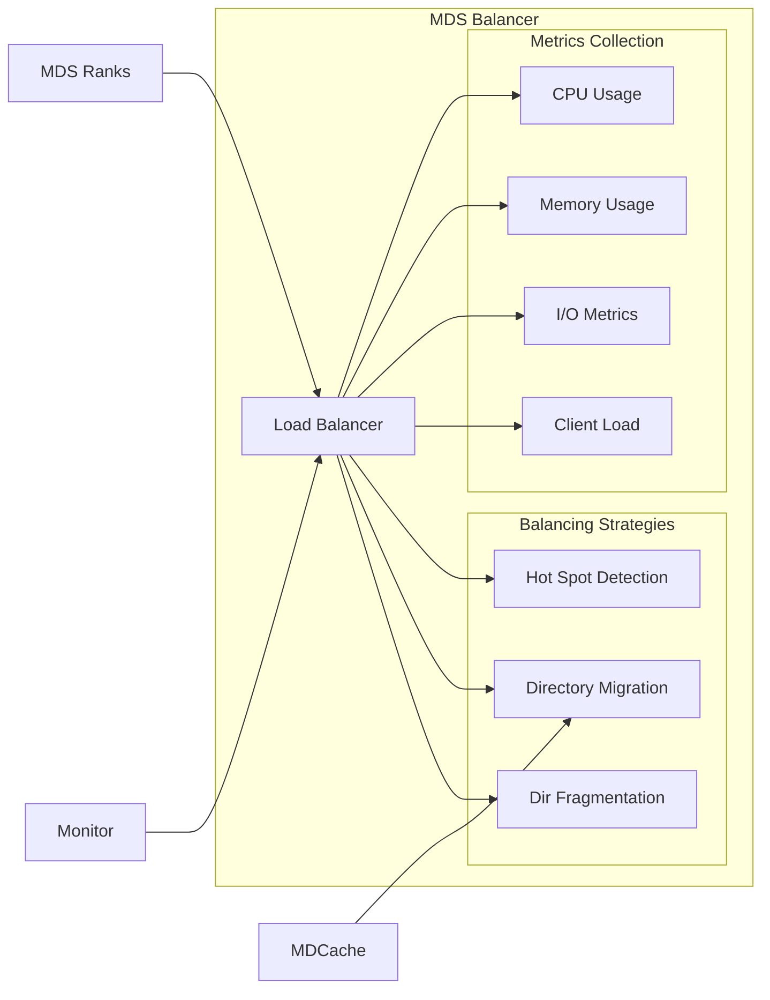

**Core Configuration:**
```bash
# Enable MDS load balancing
ceph config set mds mds_bal_mode 2

# Set load balancing thresholds
ceph config set mds mds_bal_need_min 0.2
ceph config set mds mds_bal_need_max 1.25
```

### Journal and Recovery Module

The MDS Journal module is responsible for persistent logging of metadata operations and failure recovery.

```mermaid
graph TB
    subgraph "Journal & Recovery"
        Journal[MDS Journal]
        
        subgraph "Journal Operations"
            LogEvents[Log Events]
            Segments[Journal Segments]
            Trimming[Log Trimming]
        end
        
        subgraph "Recovery Process"
            Replay[Journal Replay]
            Resolution[Conflict Resolution]
            Cleanup[Recovery Cleanup]
        end
        
        subgraph "Storage Backend"
            MDSPool[Metadata Pool]
            Objects[Journal Objects]
            RADOS_Journal[RADOS Backend]
        end
        
        Journal --> LogEvents
        Journal --> Segments
        Journal --> Trimming
        
        Journal --> Replay
        Journal --> Resolution
        Journal --> Cleanup
        
        Journal --> MDSPool
        Journal --> Objects
        Journal --> RADOS_Journal
    end
    
    MDSOperations[MDS Operations] --> LogEvents
    StandbyMDS[Standby MDS] --> Replay
    Monitor --> Resolution
```

## MDS State Machine and Lifecycle

### MDS State Transition Diagram

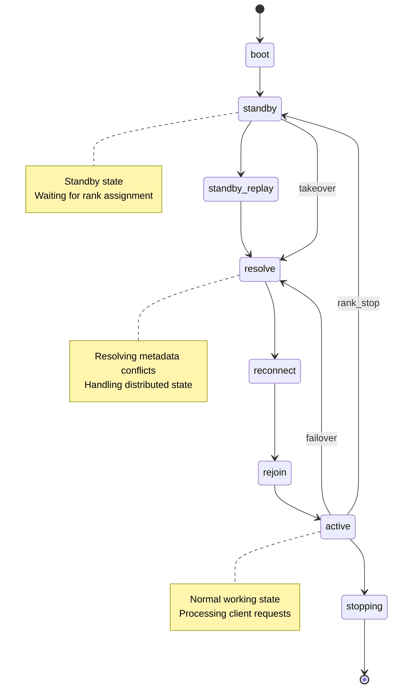

### MDS Startup and Initialization Flow

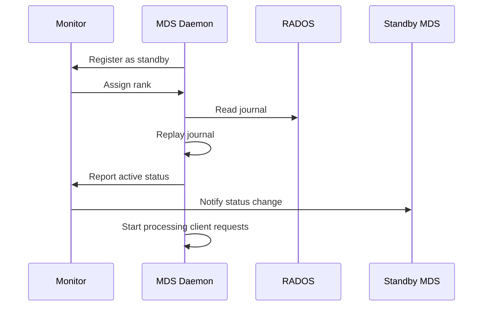

## MDS Relationships with Upstream and Downstream Components

### MDS-Monitor Interaction

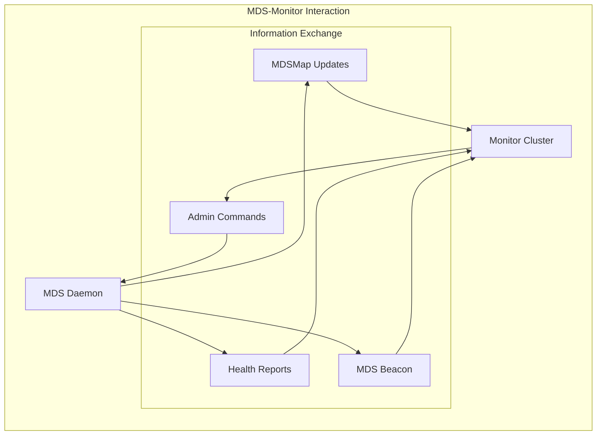

**Key Monitoring Commands:**
```bash
# View MDS health status
ceph health detail

# Check slow metadata IO
ceph mds perf dump

# View MDS alerts
ceph health mute MDS_SLOW_REQUEST

# MDS performance statistics
ceph daemon mds.<name> perf dump
```

### MDS-RADOS Interaction

MDS stores all persistent metadata through RADOS:

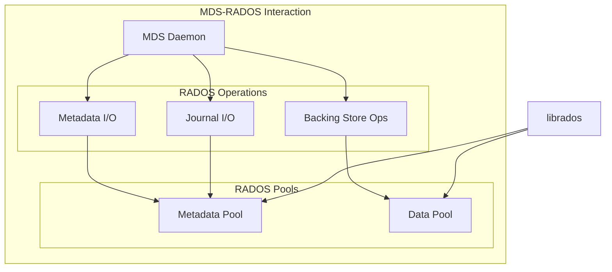

### MDS-Client Interaction

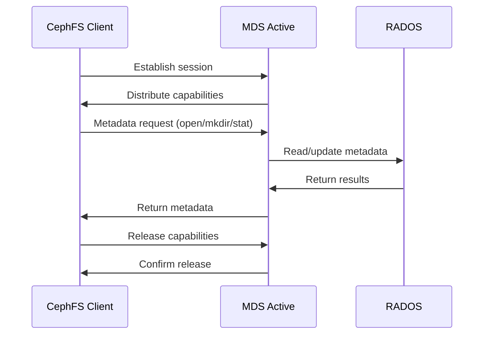


## Common MDS Troubleshooting and Recovery


```bash
# Check MDS status
ceph fs status
ceph mds stat


# MDS performance analysis
ceph daemon mds.<name> perf dump
ceph daemon mds.<name> dump cache

# Check client connections
ceph daemon mds.<name> session ls
```


## MDS Monitoring and Alerting

### Key Performance Indicators

```bash
# MDS performance monitoring
ceph daemonperf mds

# Key metrics:
# - mds.inodes: Number of cached inodes
# - mds.reply_latency: Response latency
# - mds.request_rate: Request rate
# - mds.sessions: Active session count
```

### Alert Configuration

Important alert items:
- MDS_SLOW_REQUEST: Slow request alert
- MDS_SLOW_METADATA_IO: Slow metadata IO
- MDS_INSUFFICIENT_STANDBY: Insufficient standby MDS
- MDS_HEALTH_READ_ONLY: MDS read-only status
