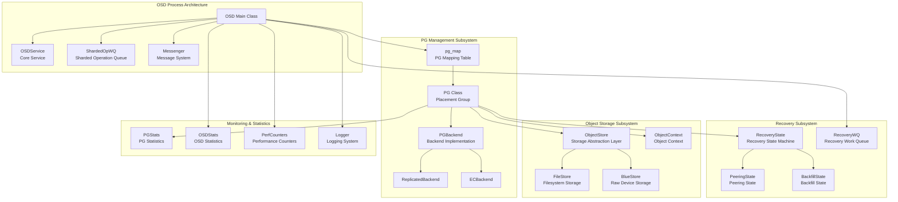
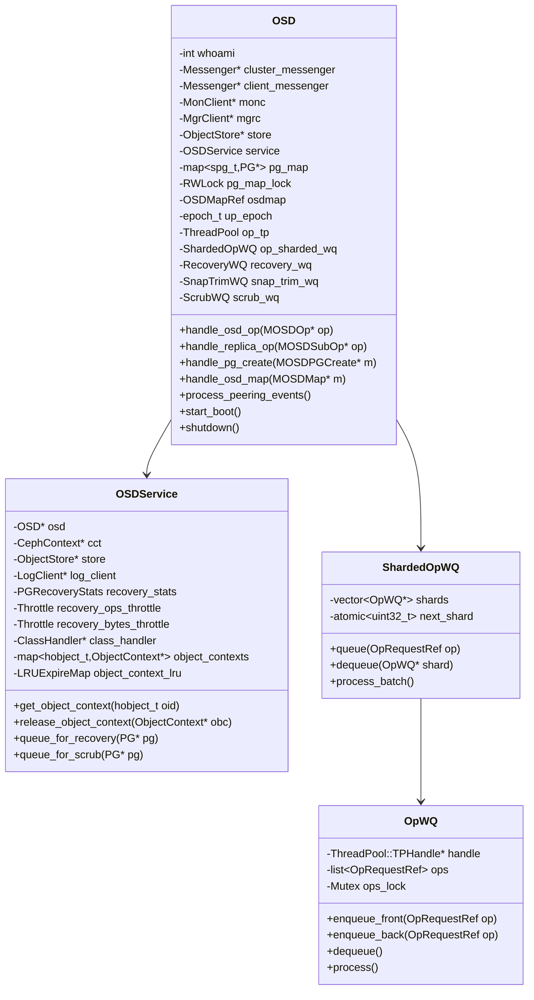
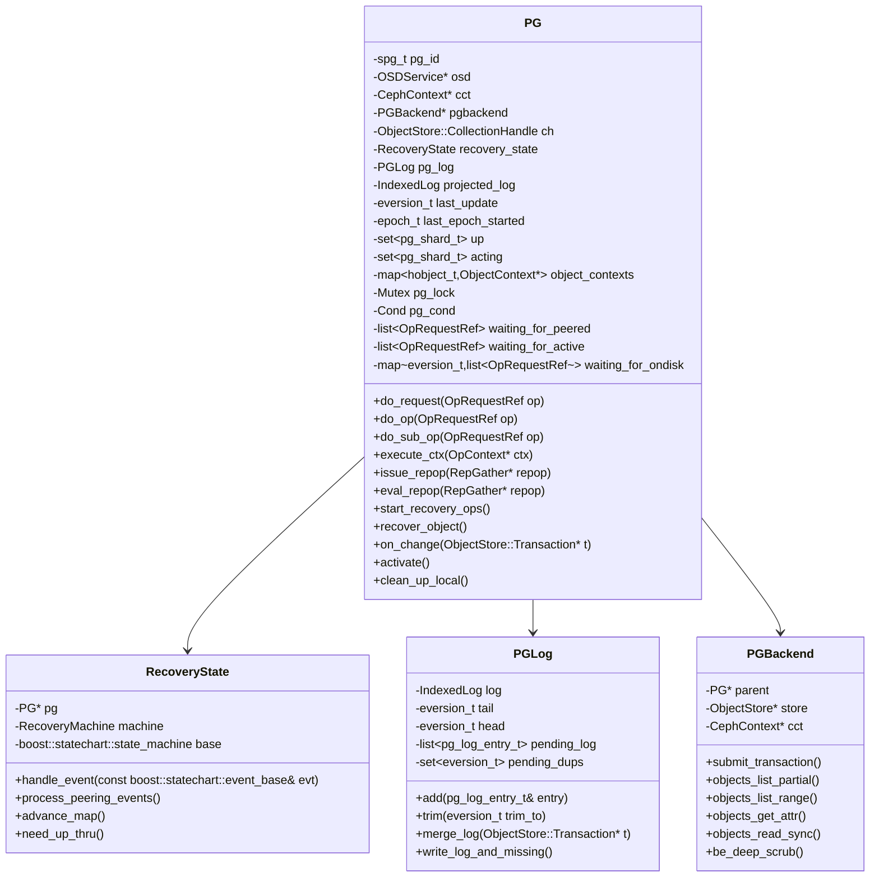
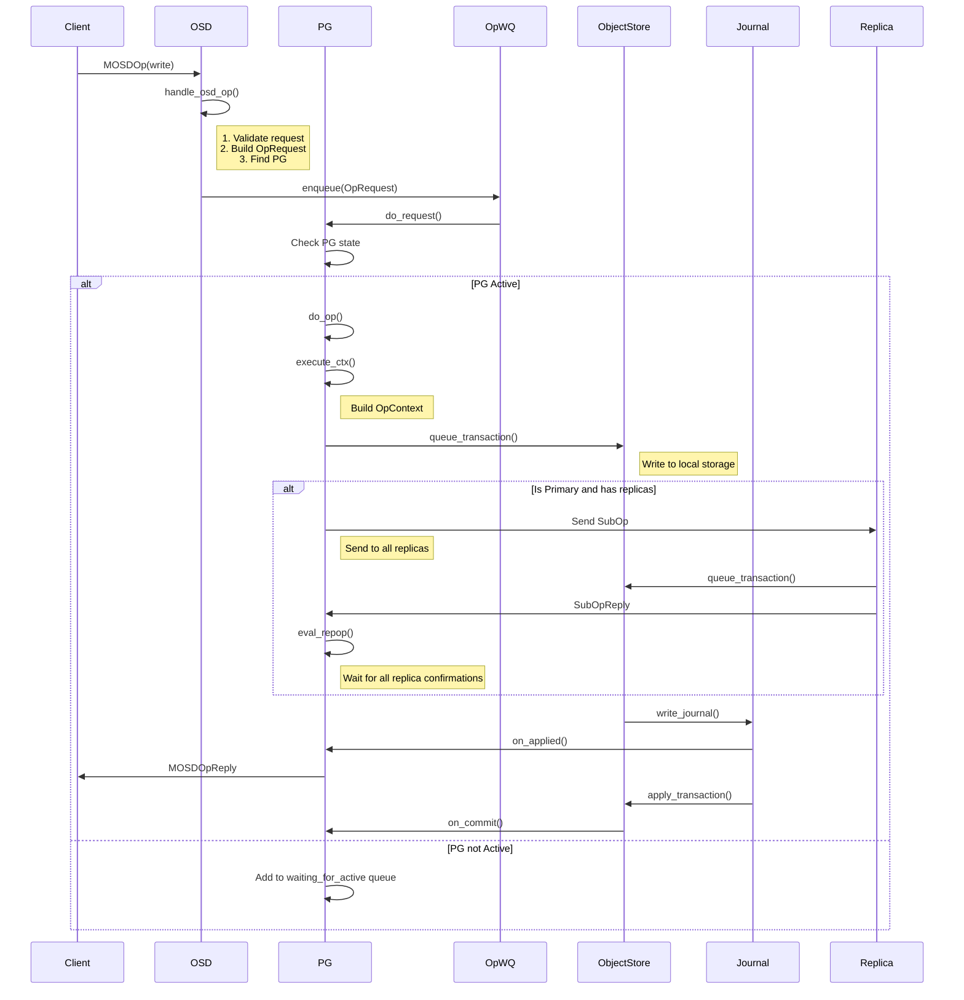
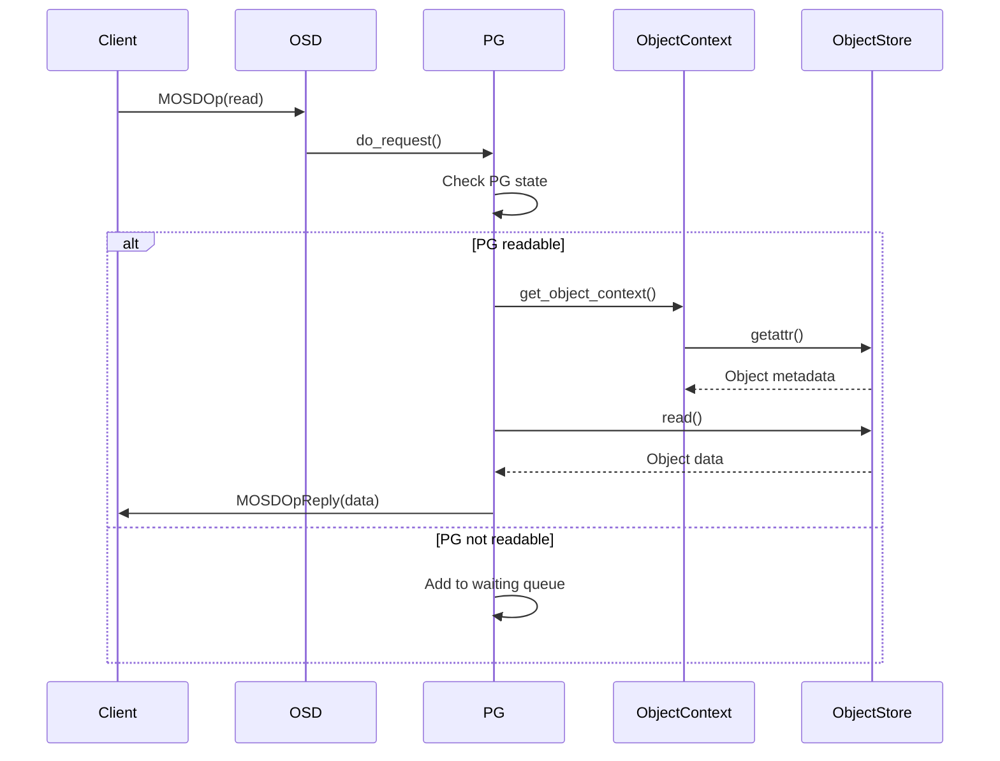

### Classical OSD Overall Architecture Diagram

### OSD Core Class Structure Details

### PG Class Detailed Structure

### Read/Write IO Processing Detailed Flow

#### Write Operation Complete Flow

#### Read Operation Flow

