## MDS 系统架构概览
Ceph MDS是CephFS (Ceph File System) 的核心组件，负责处理所有文件系统元数据操作。MDS的设计采用分布式、可扩展的架构，支持多活MDS和动态负载均衡。
### MDS在Ceph生态中的定位
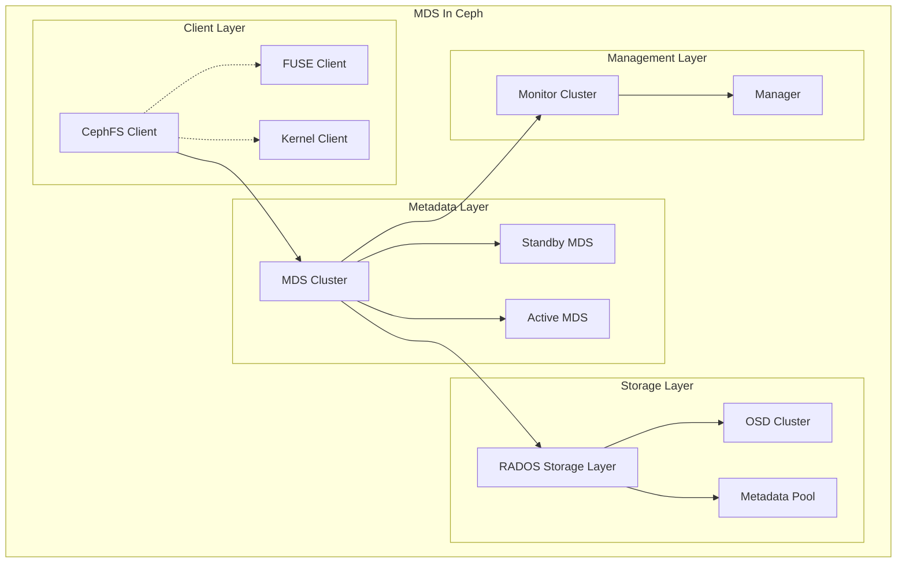
### MDS 模块架构

## MDS 核心子模块架构分析
### MDSMap 管理模块
MDSMap是MDS集群状态管理的核心模块，负责维护MDS集群的拓扑信息和状态。
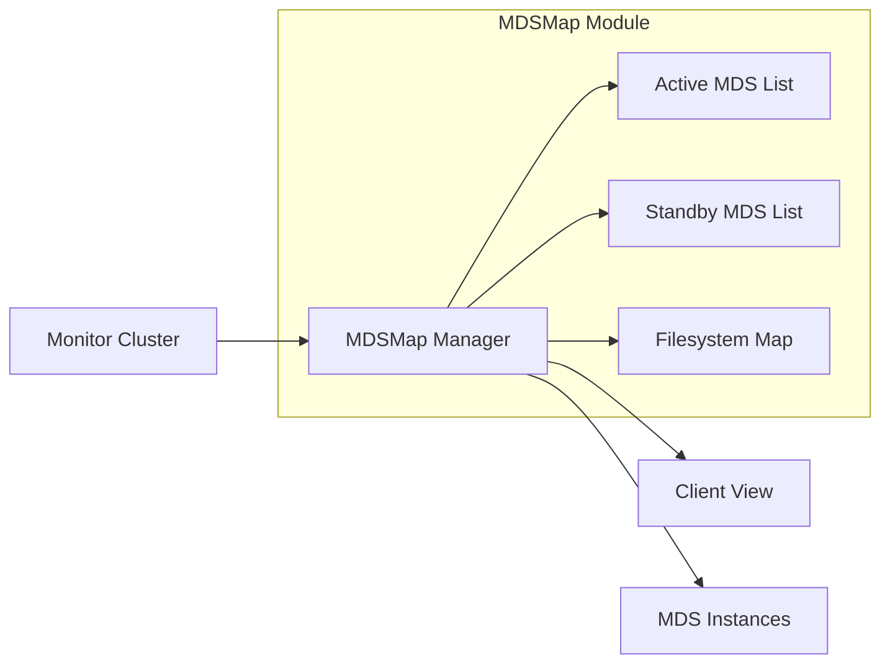
**核心功能：**
- MDS集群成员管理
- Rank分配和故障转移
- 文件系统到MDS的映射
- 状态同步和版本控制
**关键配置参数：**
```bash
# 设置最大活动MDS数量
ceph fs set <fsname> max_mds <count>
# 查看MDS状态
ceph mds stat
ceph fs status <fsname>
```
### Session管理模块
Session管理模块负责处理客户端连接和会话状态维护。
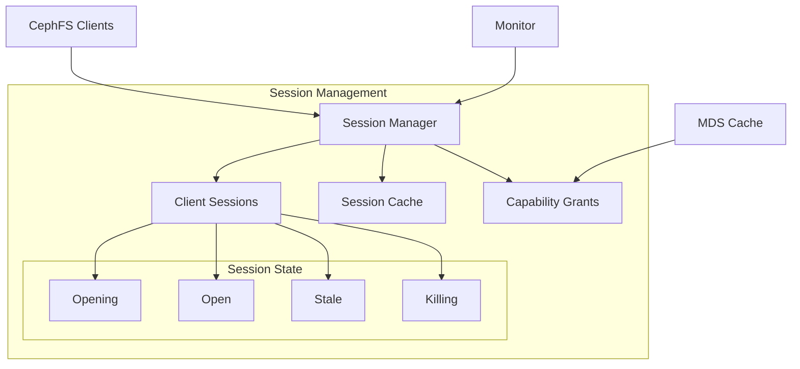
**核心功能：**
- 客户端连接认证
- 会话生命周期管理
- Capability分发和回收
- 会话超时处理
### MDCache模块
MDCache是MDS的核心缓存模块，负责元数据的缓存、一致性维护和分布式协调。
```mermaid
graph TB
    subgraph "MDCache Architecture"
        MDCache[MD Cache Manager]
        subgraph "Cache Structures"
            Inodes[Inode Cache]
            Dentries[Dentry Cache]
            Dirfrags[Dirfrag Cache]
        end
        subgraph "Cache Operations"
            Fetch[Fetch Operations]
            Discover[Discovery]
            Migration[Cache Migration]
            Trim[Cache Trimming]
        end
        subgraph "Coherency"
            Locks[Distributed Locks]
            Caps[Capabilities]
            Leases[Client Leases]
        end
        MDCache --> Inodes
        MDCache --> Dentries
        MDCache --> Dirfrags
        MDCache --> Fetch
        MDCache --> Discover
        MDCache --> Migration
        MDCache --> Trim
        MDCache --> Locks
        MDCache --> Caps
        MDCache --> Leases
    end
    RADOS[RADOS Storage] --> Fetch
    Clients[CephFS Clients] --> Caps
    OtherMDS[Other MDS] --> Migration
```
**核心功能：**
- 分布式元数据缓存
- 缓存一致性协议
- 元数据预取和预测性缓存
- 内存管理和LRU淘汰
### MDS Balancer模块
负载均衡模块确保元数据负载在多个活动MDS之间均匀分布。
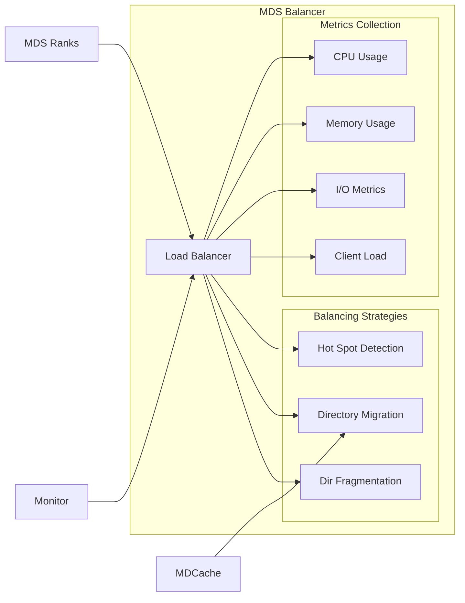
**核心配置：**
```bash
# 启用MDS负载均衡
ceph config set mds mds_bal_mode 2
# 设置负载均衡阈值
ceph config set mds mds_bal_need_min 0.2
ceph config set mds mds_bal_need_max 1.25
```
### 日志和恢复模块
MDS Journal模块负责元数据操作的持久化日志记录和故障恢复。
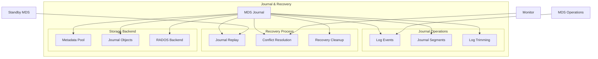
## MDS状态机和生命周期
### MDS状态转换图
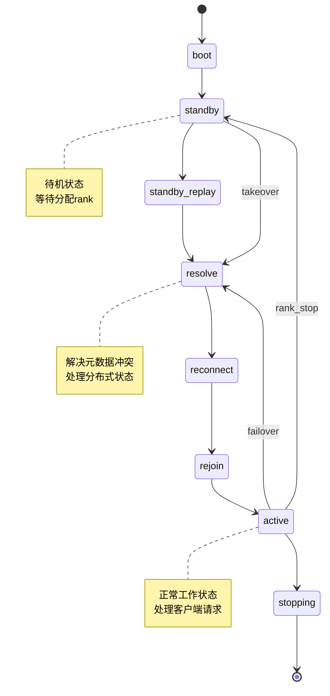
### MDS启动和初始化流程
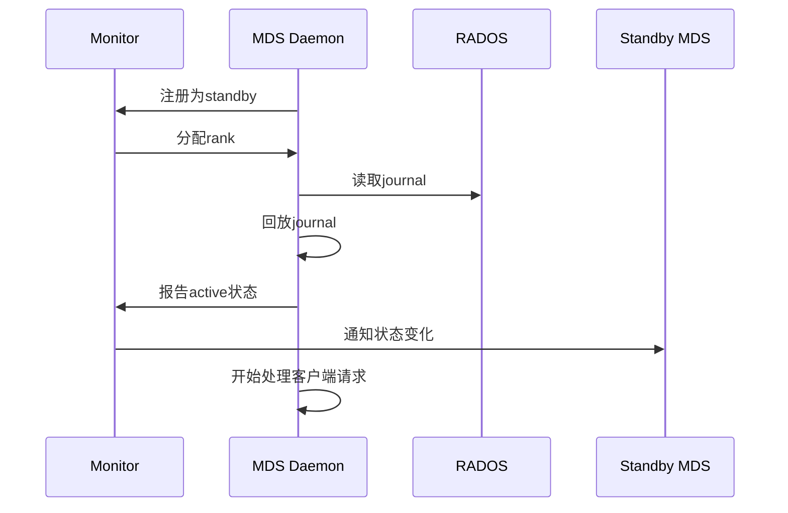
## MDS与上下游组件关系
### MDS与Monitor的交互
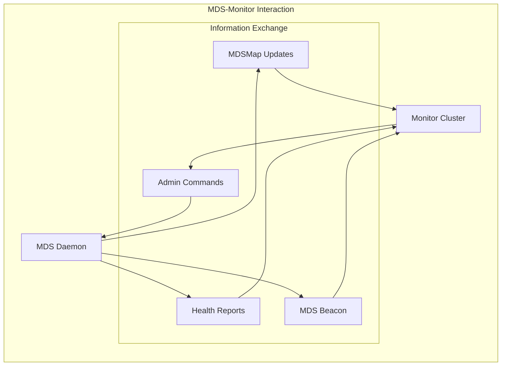
**关键监控命令：**
```bash
# 查看MDS健康状态
ceph health detail
# 检查慢速元数据IO
ceph mds perf dump
# 查看MDS告警
ceph health mute MDS_SLOW_REQUEST
# MDS性能统计
ceph daemon mds.<name> perf dump
```
### MDS与RADOS的交互
MDS通过RADOS存储所有持久化元数据：
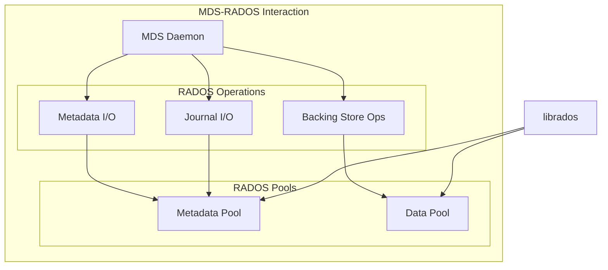
### MDS与客户端的交互
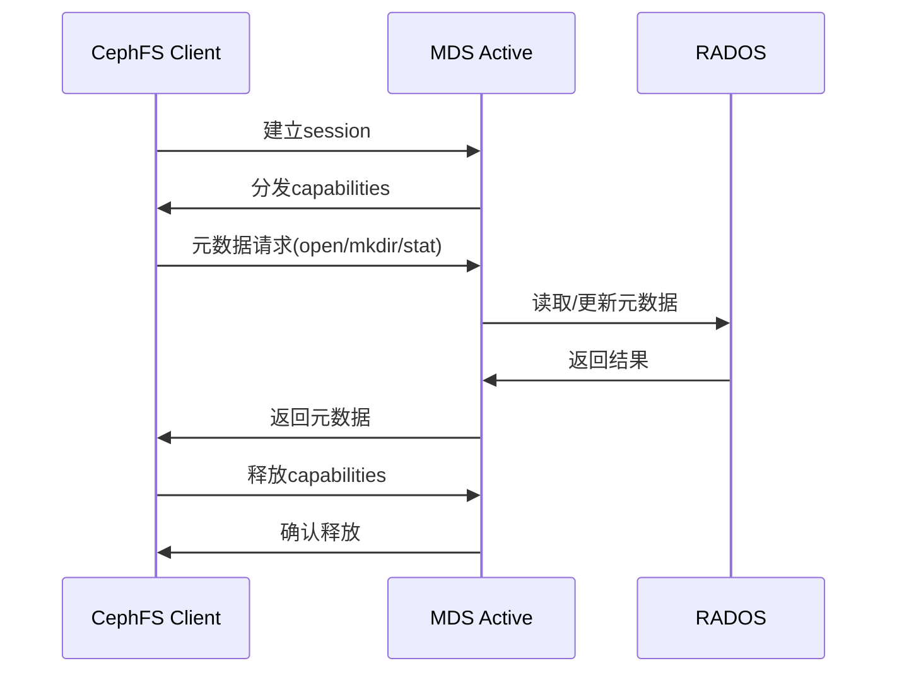
## MDS常见故障诊断和恢复
```bash
# 检查MDS状态
ceph fs status
ceph mds stat
# MDS性能分析
ceph daemon mds.<name> perf dump
ceph daemon mds.<name> dump cache
# 检查客户端连接
ceph daemon mds.<name> session ls
```
## MDS监控和告警
### 关键性能指标
```bash
# MDS性能监控
ceph daemonperf mds
# 关键指标：
# - mds.inodes: 缓存的inode数量
# - mds.reply_latency: 响应延迟
# - mds.request_rate: 请求速率
# - mds.sessions: 活动会话数
```
### 告警配置
重要告警项目：
- MDS_SLOW_REQUEST: 慢请求告警
- MDS_SLOW_METADATA_IO: 慢元数据IO
- MDS_INSUFFICIENT_STANDBY: 待机MDS不足
- MDS_HEALTH_READ_ONLY: MDS只读状态
