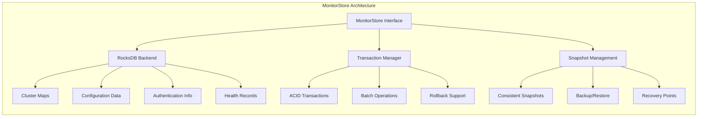
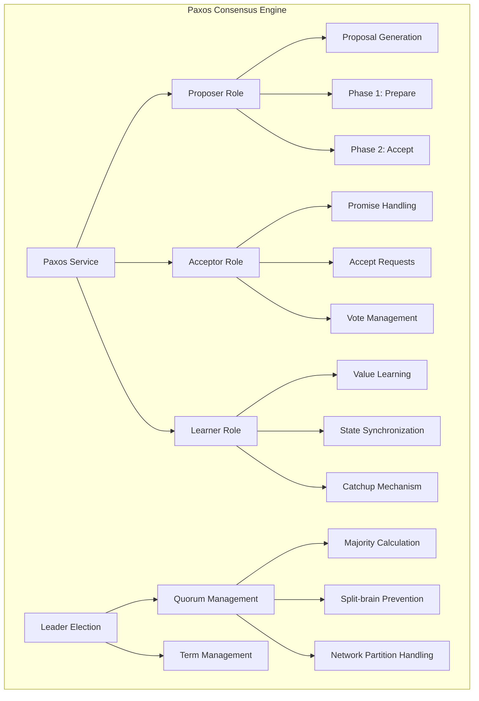
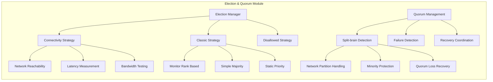
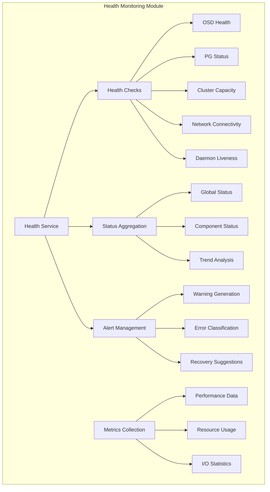
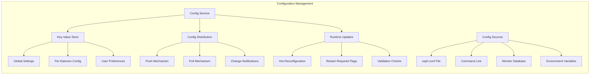
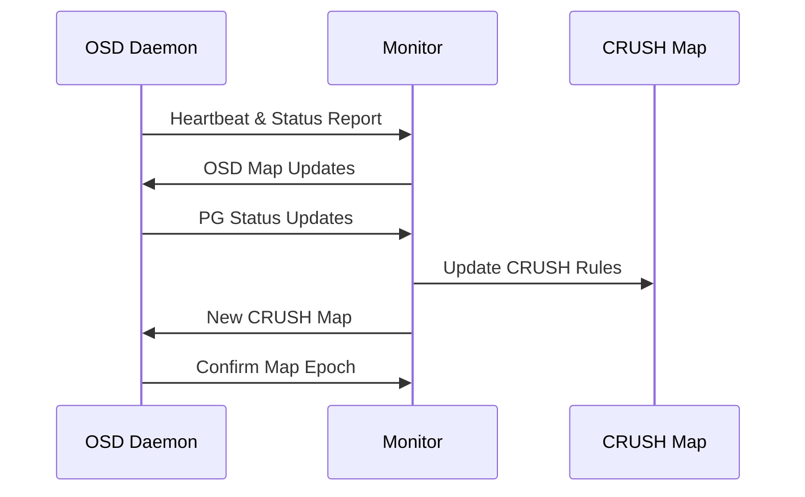
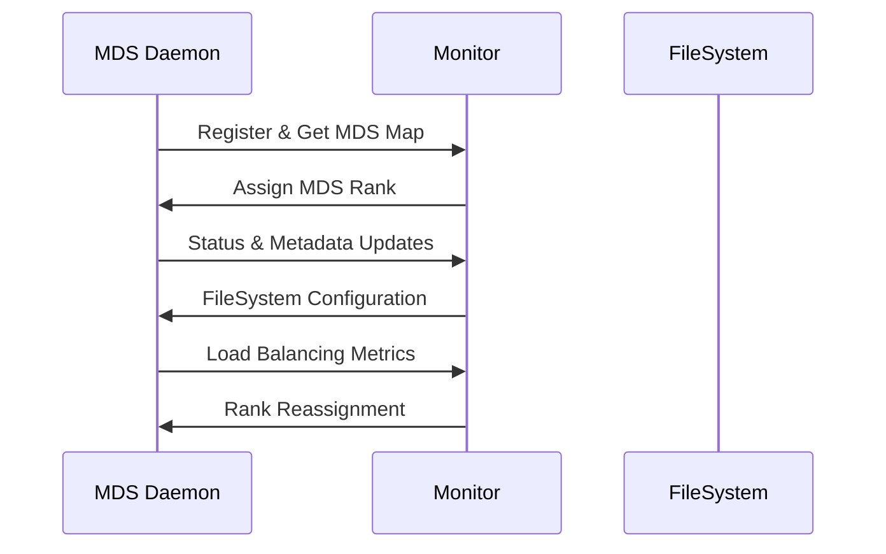

# Ceph Monitor 架构解析
## Monitor总体架构概览
### 核心功能定位
Ceph Monitor作为集群的控制平面，主要承担以下核心职责：
- **集群映射维护**：管理MonitorMap、OSDMap、CRUSHMap、MDSMap、PGMap等关键映射信息
- **状态监控与健康检查**：实时监控集群状态、生成健康报告
- **分布式一致性保证**：基于Paxos算法确保集群元数据的一致性
- **认证与授权**：管理CephX认证系统和用户权限
- **选举与仲裁**：维护Monitor quorum，处理故障恢复
### Monitor架构图

```mermaid
graph TB
    subgraph "Ceph Monitor 核心架构"
        A[Monitor Daemon] --> B[MonitorStore]
        A --> C[Paxos Engine]
        A --> D[Election Module]
        A --> E[Health Module]
        A --> F[Config Module]
        A --> G[Auth Module]
        B --> B1[ClusterMap Storage]
        B --> B2[Configuration DB]
        B --> B3[Transaction Log]
        C --> C1[Proposal Processing]
        C --> C2[Leader Election]
        C --> C3[Consensus Coordination]
        D --> D1[Connectivity Strategy]
        D --> D2[Quorum Management]
        D --> D3[Split-brain Prevention]
        E --> E1[Health Checks]
        E --> E2[Status Reporting]
        E --> E3[Alert Generation]
        F --> F1[Config Key-Value Store]
        F --> F2[Runtime Configuration]
        F --> F3[Config Distribution]
        G --> G1[CephX Authentication]
        G --> G2[User Management]
        G --> G3[Capability Control]
    end
    subgraph "外部交互"
        H[OSD Daemons] --> A
        I[MDS Daemons] --> A
        J[Client Applications] --> A
        K[Admin Tools] --> A
        L[Dashboard/Grafana] --> A
    end
```

---
## Monitor核心子模块分析
### MonitorStore存储引擎
**功能概述**：
MonitorStore是Monitor的持久化存储引擎，基于RocksDB实现，负责存储所有关键的集群元数据。
**核心架构**：

### Paxos一致性引擎
**功能概述**：
Paxos引擎是Monitor最核心的模块，实现分布式一致性算法，确保集群元数据在所有Monitor节点间保持一致。
**架构设计**：

**核心运行机制**：
1. **提案阶段**：
```bash
# 检查当前quorum状态
ceph quorum_status
```
1. **一致性保证流程**：
   - **Phase 1（准备阶段）**：Leader向所有Acceptor发送Prepare请求
   - **Phase 2（接受阶段）**：收集多数派响应后发送Accept请求
   - **Commit（提交阶段）**：达成一致后向所有节点广播提交消息
### 选举与仲裁模块
**功能概述**：
负责Monitor集群的Leader选举、quorum维护和故障检测，确保集群在各种网络条件下的可用性。
**选举策略架构**：

**关键配置参数**：
```ini
# Monitor选举相关配置
[mon]
mon_election_timeout = 5
mon_lease = 5
mon_lease_renew_interval_factor = 0.6
mon_lease_ack_timeout_factor = 2.0
mon_accept_timeout_factor = 2.0
```
**选举触发条件**：
- Monitor节点启动或重启
- 网络分区或连接断开
- Leader节点故障或无响应
- 手动触发选举（运维操作）
### 健康监控模块
**功能概述**：
实时监控集群各组件的健康状态，生成告警信息，并提供详细的诊断数据。
**监控架构**：

**健康检查命令示例**：
```bash
# 获取集群整体状态
ceph status
ceph -s
# 查看详细健康信息
ceph health detail
# 监控集群状态变化
ceph -w
# 查看特定组件状态
ceph pg stat
ceph osd stat
ceph mon stat
```
**健康状态分类**：
- **HEALTH_OK**：集群运行正常
- **HEALTH_WARN**：存在警告但不影响数据安全
- **HEALTH_ERR**：存在错误需要立即处理
### 配置管理模块
**功能概述**：
管理集群和守护进程的配置参数，支持运行时配置更新和分发。
**配置管理架构**：

**配置操作命令**：
```bash
# 设置全局配置
ceph config set global public_network 192.168.160.0/24
# 查看特定守护进程配置
ceph config show osd.0
ceph config show-with-defaults osd.0
# 设置配置键值
ceph config-key set <key> <value>
# 生成最小配置文件
ceph config generate-minimal-conf > /etc/ceph/ceph.conf
```
## Monitor与其他组件的交互关系
### Monitor-OSD交互
**交互模式**：

**关键交互内容**：
- **心跳检测**：OSD定期向Monitor报告存活状态
- **状态更新**：PG状态、容量信息、性能指标
- **映射分发**：OSD Map、CRUSH Map更新通知
- **故障处理**：OSD故障检测和标记
### Monitor-MDS交互
**交互架构**：

