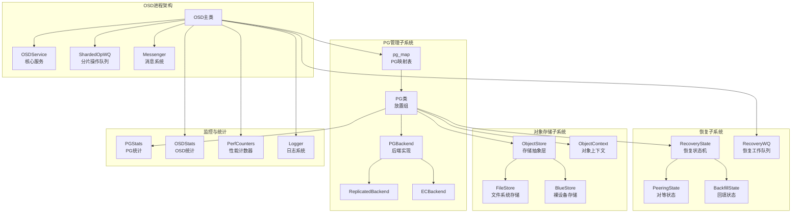
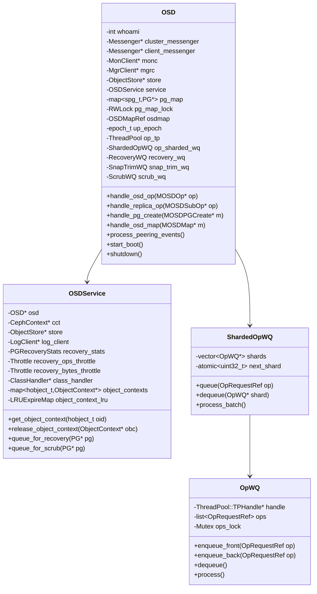
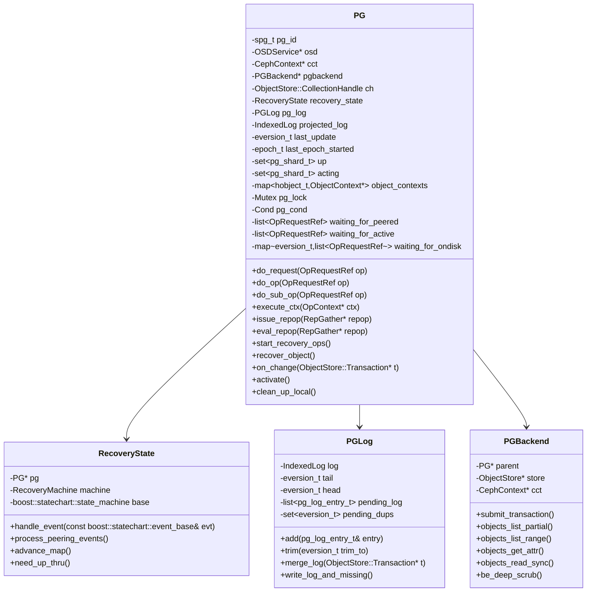
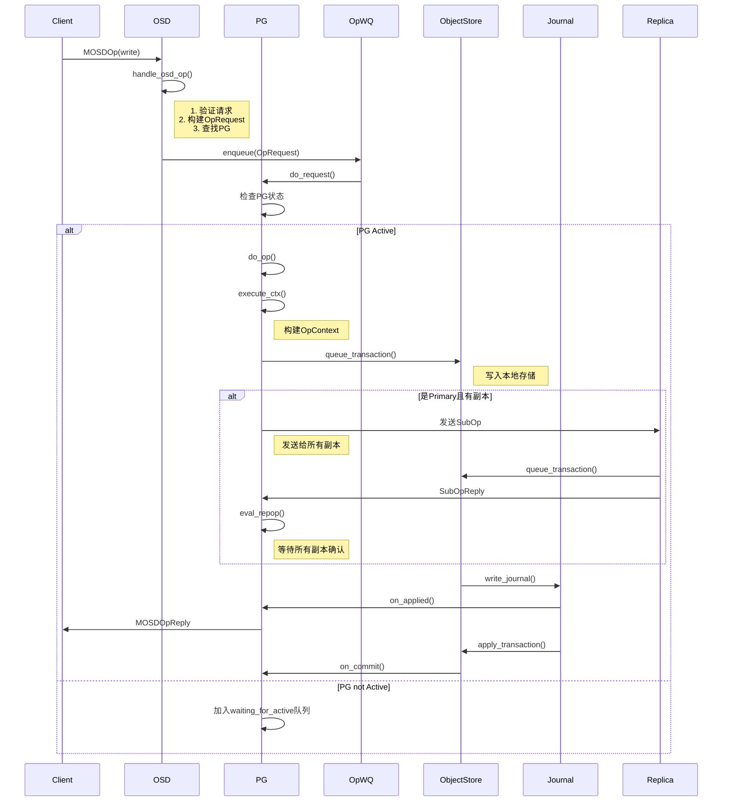
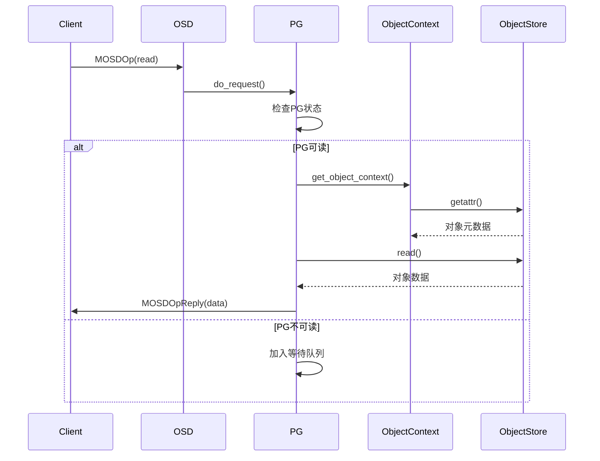

### 经典OSD整体架构图

```mermaid
graph TB
    subgraph "OSD进程架构"
        OSD[OSD主类]
        OSDService[OSDService<br/>核心服务]
        ShardedOpWQ[ShardedOpWQ<br/>分片操作队列]
        Messenger[Messenger<br/>消息系统]
    end
    
    subgraph "PG管理子系统"
        PGMap[pg_map<br/>PG映射表]
        PG[PG类<br/>放置组]
        PGBackend[PGBackend<br/>后端实现]
        ReplicatedBackend[ReplicatedBackend]
        ECBackend[ECBackend]
    end
    
    subgraph "对象存储子系统"
        ObjectStore[ObjectStore<br/>存储抽象层]
        FileStore[FileStore<br/>文件系统存储]
        BlueStore[BlueStore<br/>裸设备存储]
        ObjectContext[ObjectContext<br/>对象上下文]
    end
    
    subgraph "恢复子系统"
        RecoveryState[RecoveryState<br/>恢复状态机]
        PeeringState[PeeringState<br/>对等状态]
        BackfillState[BackfillState<br/>回填状态]
        RecoveryWQ[RecoveryWQ<br/>恢复工作队列]
    end
    
    subgraph "监控与统计"
        PGStats[PGStats<br/>PG统计]
        OSDStats[OSDStats<br/>OSD统计]
        PerfCounters[PerfCounters<br/>性能计数器]
        Logger[Logger<br/>日志系统]
    end
    
    OSD --> OSDService
    OSD --> ShardedOpWQ
    OSD --> Messenger
    OSD --> PGMap
    PGMap --> PG
    PG --> PGBackend
    PGBackend --> ReplicatedBackend
    PGBackend --> ECBackend
    PG --> ObjectStore
    ObjectStore --> FileStore
    ObjectStore --> BlueStore
    PG --> ObjectContext
    PG --> RecoveryState
    RecoveryState --> PeeringState
    RecoveryState --> BackfillState
    OSD --> RecoveryWQ
    PG --> PGStats
    OSD --> OSDStats
    OSD --> PerfCounters
    OSD --> Logger
```

### OSD核心类结构详解

```mermaid
classDiagram
    class OSD {
        -int whoami
        -Messenger* cluster_messenger
        -Messenger* client_messenger
        -MonClient* monc
        -MgrClient* mgrc
        -ObjectStore* store
        -OSDService service
        -map~spg_t,PG*~ pg_map
        -RWLock pg_map_lock
        -OSDMapRef osdmap
        -epoch_t up_epoch
        -ThreadPool op_tp
        -ShardedOpWQ op_sharded_wq
        -RecoveryWQ recovery_wq
        -SnapTrimWQ snap_trim_wq
        -ScrubWQ scrub_wq
        +handle_osd_op(MOSDOp* op)
        +handle_replica_op(MOSDSubOp* op)
        +handle_pg_create(MOSDPGCreate* m)
        +handle_osd_map(MOSDMap* m)
        +process_peering_events()
        +start_boot()
        +shutdown()
    }
    
    class OSDService {
        -OSD* osd
        -CephContext* cct
        -ObjectStore* store
        -LogClient* log_client
        -PGRecoveryStats recovery_stats
        -Throttle recovery_ops_throttle
        -Throttle recovery_bytes_throttle
        -ClassHandler* class_handler
        -map~hobject_t,ObjectContext*~ object_contexts
        -LRUExpireMap object_context_lru
        +get_object_context(hobject_t oid)
        +release_object_context(ObjectContext* obc)
        +queue_for_recovery(PG* pg)
        +queue_for_scrub(PG* pg)
    }
    
    class ShardedOpWQ {
        -vector~OpWQ*~ shards
        -atomic~uint32_t~ next_shard
        +queue(OpRequestRef op)
        +dequeue(OpWQ* shard)
        +process_batch()
    }
    
    class OpWQ {
        -ThreadPool::TPHandle* handle
        -list~OpRequestRef~ ops
        -Mutex ops_lock
        +enqueue_front(OpRequestRef op)
        +enqueue_back(OpRequestRef op)
        +dequeue()
        +process()
    }
    
    OSD --> OSDService
    OSD --> ShardedOpWQ
    ShardedOpWQ --> OpWQ
```

### PG类详细结构

```mermaid
classDiagram
    class PG {
        -spg_t pg_id
        -OSDService* osd
        -CephContext* cct
        -PGBackend* pgbackend
        -ObjectStore::CollectionHandle ch
        -RecoveryState recovery_state
        -PGLog pg_log
        -IndexedLog projected_log
        -eversion_t last_update
        -epoch_t last_epoch_started
        -set~pg_shard_t~ up
        -set~pg_shard_t~ acting
        -map~hobject_t,ObjectContext*~ object_contexts
        -Mutex pg_lock
        -Cond pg_cond
        -list~OpRequestRef~ waiting_for_peered
        -list~OpRequestRef~ waiting_for_active
        -map~eversion_t,list~OpRequestRef~~ waiting_for_ondisk
        +do_request(OpRequestRef op)
        +do_op(OpRequestRef op)
        +do_sub_op(OpRequestRef op)
        +execute_ctx(OpContext* ctx)
        +issue_repop(RepGather* repop)
        +eval_repop(RepGather* repop)
        +start_recovery_ops()
        +recover_object()
        +on_change(ObjectStore::Transaction* t)
        +activate()
        +clean_up_local()
    }
    
    class RecoveryState {
        -PG* pg
        -RecoveryMachine machine
        -boost::statechart::state_machine base
        +handle_event(const boost::statechart::event_base& evt)
        +process_peering_events()
        +advance_map()
        +need_up_thru()
    }
    
    class PGLog {
        -IndexedLog log
        -eversion_t tail
        -eversion_t head
        -list~pg_log_entry_t~ pending_log
        -set~eversion_t~ pending_dups
        +add(pg_log_entry_t& entry)
        +trim(eversion_t trim_to)
        +merge_log(ObjectStore::Transaction* t)
        +write_log_and_missing()
    }
    
    class PGBackend {
        -PG* parent
        -ObjectStore* store
        -CephContext* cct
        +submit_transaction()
        +objects_list_partial()
        +objects_list_range()
        +objects_get_attr()
        +objects_read_sync()
        +be_deep_scrub()
    }
    
    PG --> RecoveryState
    PG --> PGLog
    PG --> PGBackend
```

### 读写IO处理详细流程

#### 写操作完整流程

```mermaid
sequenceDiagram
    participant Client
    participant OSD
    participant PG
    participant OpWQ
    participant ObjectStore
    participant Journal
    participant Replica
    
    Client->>OSD: MOSDOp(write)
    OSD->>OSD: handle_osd_op()
    Note right of OSD: 1. 验证请求<br/>2. 构建OpRequest<br/>3. 查找PG
    
    OSD->>OpWQ: enqueue(OpRequest)
    OpWQ->>PG: do_request()
    
    PG->>PG: 检查PG状态
    alt PG Active
        PG->>PG: do_op()
        PG->>PG: execute_ctx()
        Note right of PG: 构建OpContext
        
        PG->>ObjectStore: queue_transaction()
        Note right of ObjectStore: 写入本地存储
        
        alt 是Primary且有副本
            PG->>Replica: 发送SubOp
            Note right of PG: 发送给所有副本
            
            Replica->>ObjectStore: queue_transaction()
            Replica->>PG: SubOpReply
            
            PG->>PG: eval_repop()
            Note right of PG: 等待所有副本确认
        end
        
        ObjectStore->>Journal: write_journal()
        Journal->>PG: on_applied()
        PG->>Client: MOSDOpReply
        
        Journal->>ObjectStore: apply_transaction()
        ObjectStore->>PG: on_commit()
        
    else PG not Active
        PG->>PG: 加入waiting_for_active队列
    end
```

#### 读操作流程

```mermaid
sequenceDiagram
    participant Client
    participant OSD
    participant PG
    participant ObjectContext
    participant ObjectStore
    
    Client->>OSD: MOSDOp(read)
    OSD->>PG: do_request()
    
    PG->>PG: 检查PG状态
    alt PG可读
        PG->>ObjectContext: get_object_context()
        ObjectContext->>ObjectStore: getattr()
        ObjectStore-->>ObjectContext: 对象元数据
        
        PG->>ObjectStore: read()
        ObjectStore-->>PG: 对象数据
        
        PG->>Client: MOSDOpReply(data)
    else PG不可读
        PG->>PG: 加入等待队列
    end
```
