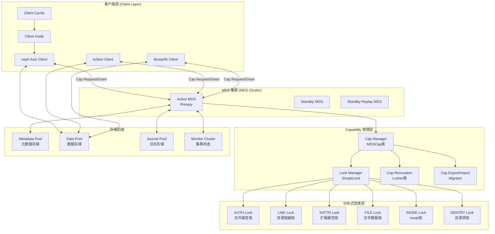
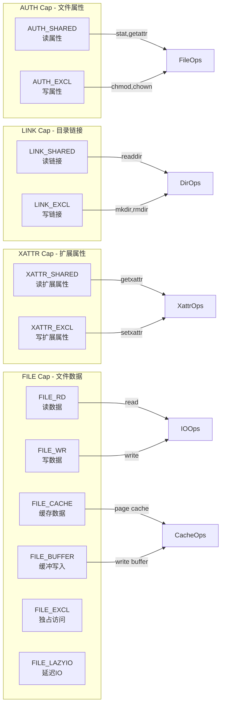
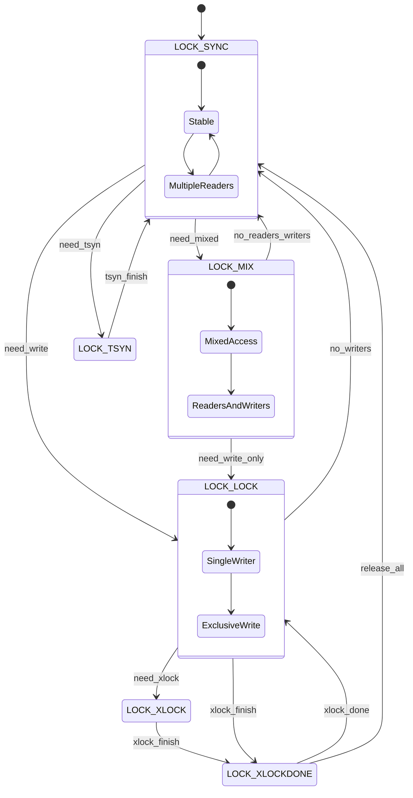
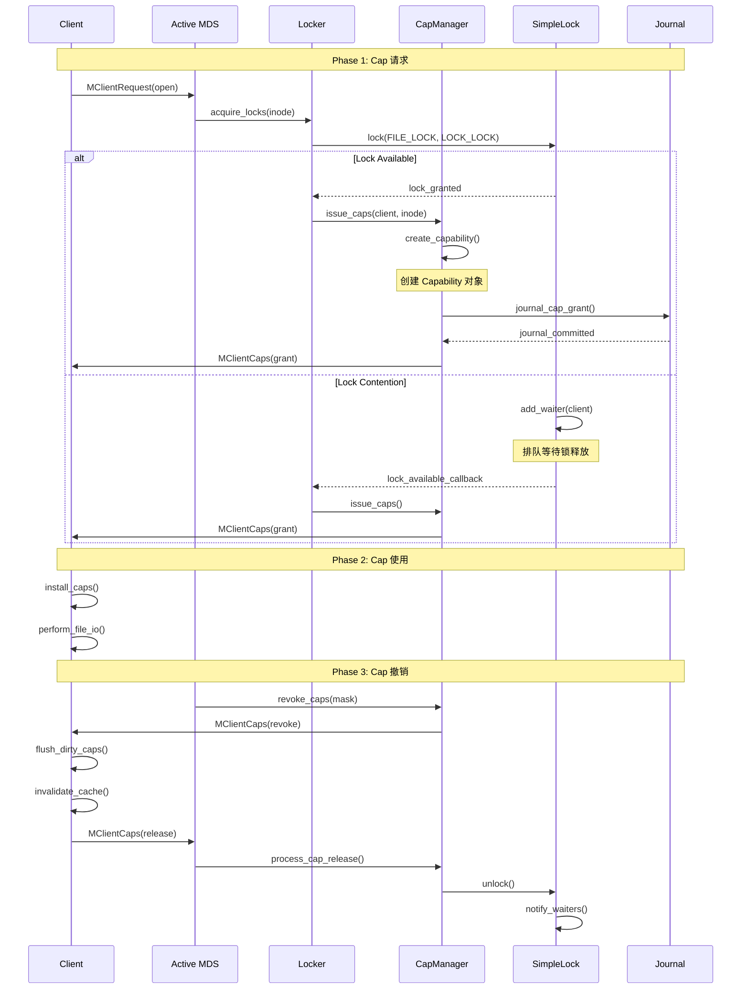
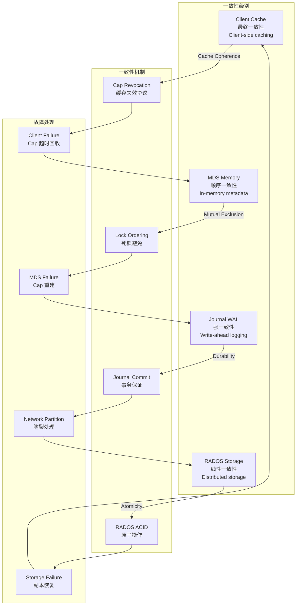
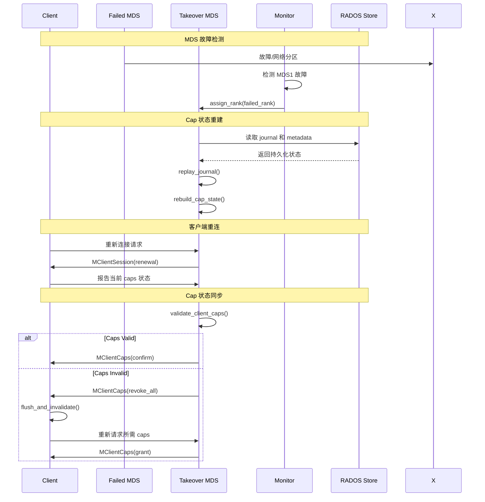

# CephFS Caps 机制深度技术分析

## 🏗️ 核心架构概览

CephFS 的 capability (caps) 机制是一个复杂的分布式一致性系统，用于管理客户端对文件系统对象的访问权限。它结合了分布式锁、缓存一致性和访问控制。

### 架构组件关系图



## 🔐 Capability 权限类型详解

### 权限位掩码定义

```cpp
// src/include/ceph_fs.h - Capability 位定义
#define CEPH_CAP_GSHARED     1   /* 共享读权限 */
#define CEPH_CAP_GEXCL       2   /* 独占写权限 */
#define CEPH_CAP_GCACHE      4   /* 缓存权限 */
#define CEPH_CAP_GRD         8   /* 读数据权限 */
#define CEPH_CAP_GWR        16   /* 写数据权限 */
#define CEPH_CAP_GBUFFER    32   /* 缓冲写权限 */
#define CEPH_CAP_GWREXTEND  64   /* 扩展写权限 */
#define CEPH_CAP_GLAZYIO   128   /* 延迟IO权限 */

// 组合权限定义
#define CEPH_CAP_AUTH_SHARED  (CEPH_CAP_GSHARED)
#define CEPH_CAP_AUTH_EXCL    (CEPH_CAP_GEXCL | CEPH_CAP_GSHARED)

#define CEPH_CAP_LINK_SHARED  (CEPH_CAP_GSHARED) 
#define CEPH_CAP_LINK_EXCL    (CEPH_CAP_GEXCL | CEPH_CAP_GSHARED)

#define CEPH_CAP_XATTR_SHARED (CEPH_CAP_GSHARED)
#define CEPH_CAP_XATTR_EXCL   (CEPH_CAP_GEXCL | CEPH_CAP_GSHARED)

#define CEPH_CAP_FILE_RD      (CEPH_CAP_GSHARED | CEPH_CAP_GRD)
#define CEPH_CAP_FILE_WR      (CEPH_CAP_GEXCL | CEPH_CAP_GWR | CEPH_CAP_GSHARED)
#define CEPH_CAP_FILE_CACHE   (CEPH_CAP_GCACHE)
#define CEPH_CAP_FILE_BUFFER  (CEPH_CAP_GBUFFER)
#define CEPH_CAP_FILE_EXCL    (CEPH_CAP_GEXCL)
#define CEPH_CAP_FILE_WR_EXTEND (CEPH_CAP_GWREXTEND)
#define CEPH_CAP_FILE_LAZYIO  (CEPH_CAP_GLAZYIO)
```

### Capability 类型映射图



## 🔄 Lock 状态机和转换

### SimpleLock 状态机



## 🔄 Cap 工作流程详解

### 完整的 Capability 生命周期



## 🏛️ 核心数据结构

### 客户端 Capability 结构

```cpp
// src/client/Inode.h
class Cap {
public:
    MetaSession *session;        // MDS 会话指针
    uint64_t cap_id;            // Capability ID
    unsigned issued;            // 已发放的权限位
    unsigned implemented;       // 已实现的权限位
    unsigned wanted;            // 想要的权限位
    unsigned pending;           // 待处理的权限位
    
    utime_t last_used;          // 最后使用时间
    int64_t gen;               // 生成版本号
    int64_t cap_gen;           // Cap 生成号
    int64_t seq;               // 序列号
    int64_t issue_seq;         // 发放序列号
    int64_t mseq;              // MDS 序列号
    
    // Cap 权限检查
    bool is_valid() const { return session != nullptr; }
    bool issued_caps_need_check() const;
    void touch() { last_used = ceph_clock_now(); }
};

// 客户端 Inode 扩展
class Inode {
    // ... 其他成员
    std::map<mds_rank_t, Cap> caps;  // 各 MDS 的 caps
    unsigned caps_issued() const;    // 已发放的所有 caps
    unsigned caps_wanted() const;    // 想要的所有 caps
    void get_caps_issued(unsigned *issued, unsigned *implemented);
};
```

### MDS 端 Capability 结构

```cpp
// src/mds/Capability.h
class Capability {
    client_t client;            // 客户端标识
    CInode *inode;             // 指向的 inode
    uint64_t cap_id;           // Cap ID
    
    unsigned issued_;          // 已发放权限
    unsigned pending_;         // 待处理权限  
    unsigned wanted_;          // 客户端想要的权限
    
    utime_t last_sent;         // 最后发送时间
    utime_t last_revoke_stamp; // 最后撤销时间
    int64_t trans_seq;         // 事务序列号
    int64_t client_follows;    // 客户端跟随序列号
    
public:
    // 权限管理方法
    void set_wanted(unsigned w) { wanted_ = w; }
    void inc_suppress() { suppress++; }
    void dec_suppress() { suppress--; }
    
    bool is_suppress() const { return suppress > 0; }
    bool is_stale() const;
    bool is_valid() const { return client > 0; }
    
    // 权限检查
    unsigned issued() const { return issued_; }
    unsigned pending() const { return pending_; }
    unsigned wanted() const { return wanted_; }
};
```

## 🔧 关键函数实现

### Cap 发放核心函数

```cpp
// src/mds/Locker.cc
void Locker::issue_caps(CInode *in, Capability *cap) {
    dout(7) << "issue_caps for " << *in << " to client." << cap->get_client() << dendl;
    
    unsigned was_issued = cap->issued();
    unsigned wanted = cap->wanted();
    unsigned issued = 0;
    
    // 检查各种锁的状态来决定可以发放的权限
    
    // AUTH cap - 文件属性权限
    if (in->authlock.can_read(cap->get_client())) {
        issued |= CEPH_CAP_AUTH_SHARED;
    }
    if (in->authlock.can_write(cap->get_client())) {
        issued |= CEPH_CAP_AUTH_EXCL;
    }
    
    // LINK cap - 目录链接权限
    if (in->linklock.can_read(cap->get_client())) {
        issued |= CEPH_CAP_LINK_SHARED;
    }
    if (in->linklock.can_write(cap->get_client())) {
        issued |= CEPH_CAP_LINK_EXCL;
    }
    
    // XATTR cap - 扩展属性权限
    if (in->xattrlock.can_read(cap->get_client())) {
        issued |= CEPH_CAP_XATTR_SHARED;
    }
    if (in->xattrlock.can_write(cap->get_client())) {
        issued |= CEPH_CAP_XATTR_EXCL;
    }
    
    // FILE cap - 文件数据权限 (最复杂)
    if (in->filelock.can_read(cap->get_client())) {
        issued |= CEPH_CAP_FILE_RD;
        if (in->filelock.can_read_projected(cap->get_client())) {
            issued |= CEPH_CAP_FILE_CACHE;
        }
    }
    
    if (in->filelock.can_write(cap->get_client())) {
        issued |= CEPH_CAP_FILE_WR;
        if (in->filelock.can_write_projected(cap->get_client())) {
            issued |= CEPH_CAP_FILE_BUFFER;
            if (in->filelock.get_state() == LOCK_EXCL) {
                issued |= CEPH_CAP_FILE_EXCL;
            }
        }
    }
    
    // 限制权限为客户端实际想要的
    issued &= wanted;
    
    // 如果权限有变化，发送 grant 消息
    if (issued != was_issued) {
        cap->set_issued(issued);
        send_cap_grant(cap, issued);
        
        // 记录到日志
        if (mds->mdlog->get_write_pos() > 0) {
            mds->mdlog->submit_entry(new EMetaBlob(mds->mdlog));
        }
    }
}

// Cap 撤销核心函数
void Locker::revoke_caps(CInode *in, int revoke_mask, client_t client) {
    dout(7) << "revoke_caps " << ccap_string(revoke_mask) 
            << " on " << *in << dendl;
    
    auto it = in->get_client_caps().find(client);
    if (it == in->get_client_caps().end()) {
        return; // 客户端没有 caps
    }
    
    Capability *cap = it->second;
    unsigned revoking = cap->issued() & revoke_mask;
    
    if (revoking) {
        dout(7) << " revoking " << ccap_string(revoking) 
                << " from client." << client << dendl;
        
        cap->set_pending(cap->pending() | revoking);
        cap->set_issued(cap->issued() & ~revoking);
        
        // 发送撤销消息
        send_cap_revoke(cap, revoking);
        
        // 设置撤销超时
        if (!cap->is_suppress()) {
            mds->locker->set_cap_revoke_timeout(cap);
        }
    }
}
```

### 锁状态检查函数

```cpp
// src/mds/locks.cc
bool SimpleLock::can_read(client_t client) {
    switch (state) {
        case LOCK_SYNC:
            return true;  // 同步状态允许所有客户端读
            
        case LOCK_MIX:
            return true;  // 混合状态允许读
            
        case LOCK_LOCK:
            // 锁定状态只允许锁持有者读
            return is_rdlocked_by(client) || is_wrlocked_by(client);
            
        case LOCK_XLOCK:
            // 排他锁状态只允许锁持有者
            return is_xlocked_by(client);
            
        default:
            return false;
    }
}

bool SimpleLock::can_write(client_t client) {
    switch (state) {
        case LOCK_LOCK:
            return is_wrlocked_by(client);
            
        case LOCK_XLOCK:
            return is_xlocked_by(client);
            
        default:
            return false;
    }
}

// 锁状态转换
void SimpleLock::go_lock() {
    dout(7) << "go_lock on " << *get_parent() << dendl;
    
    state = LOCK_LOCK;
    
    // 撤销所有客户端的读权限，除了获得写锁的客户端
    for (auto& p : parent->get_client_caps()) {
        client_t client = p.first;
        if (client != lock_client) {
            revoke_client_caps(client, CEPH_CAP_FILE_RD);
        }
    }
}
```

## 🔄 分布式一致性保证机制

### 一致性层次模型



### Cap 迁移流程 (MDS Failover)



## 📊 性能优化策略

### Cap 缓存优化

```cpp
// src/client/Client.cc - 客户端 Cap 缓存优化
class Client {
    // Cap 缓存管理
    LRUObjects cap_lru;        // Cap LRU 缓存
    uint64_t max_caps_cache;   // 最大缓存 caps 数量
    
    void trim_caps() {
        while (cap_lru.lru_get_size() > max_caps_cache) {
            Inode *in = static_cast<Inode*>(cap_lru.lru_expire());
            if (in) {
                release_caps(in, CEPH_CAP_FILE_CACHE);
            }
        }
    }
    
    // 智能 Cap 预测
    void predict_caps_needed(Inode *in, unsigned &wanted) {
        // 基于访问模式预测需要的权限
        if (in->access_pattern & ACCESS_PATTERN_SEQUENTIAL) {
            wanted |= CEPH_CAP_FILE_CACHE;
        }
        if (in->access_pattern & ACCESS_PATTERN_RANDOM) {
            wanted |= CEPH_CAP_FILE_RD;
        }
        if (in->dirty_pages > 0) {
            wanted |= CEPH_CAP_FILE_BUFFER;
        }
    }
};
```

